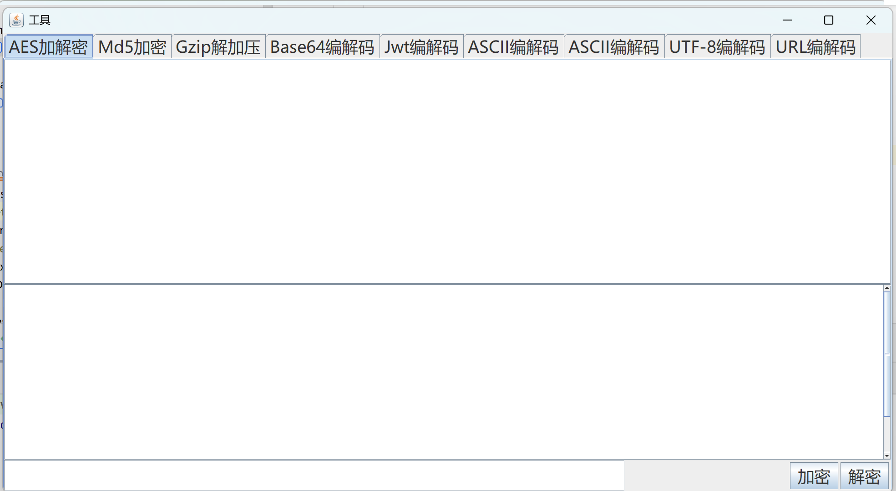

## 工具目的
在许多场景中需要处理数据的加解密，通常我们会使用网络上的在线加解密工具，但有时出于网络条件、数据安全等原因，使用一个本地的、不联网的、即点即用的工具也是一个好选择。

## 工具特点
使用jswing编写的简单窗体程序，打包后点击jar包即可启用（可以用web分离前后端，但是工具本身目的就是为了便利，所以直接用jswing写了，虽然有点丑，但是能用就行）
字体随窗口大小而变化

## 项目运行效果图

## 目前的功能
支持输入密钥的AES加解密
支持MD5加密
支持Gzip加压解压
支持Base64编码解码
支持输入密钥的JWT加解密
支持ASCII编码解码
支持Unicode编码解码
支持UTF-8编码解码
支持URL编码解码

## 反馈、更新
具体可提issue